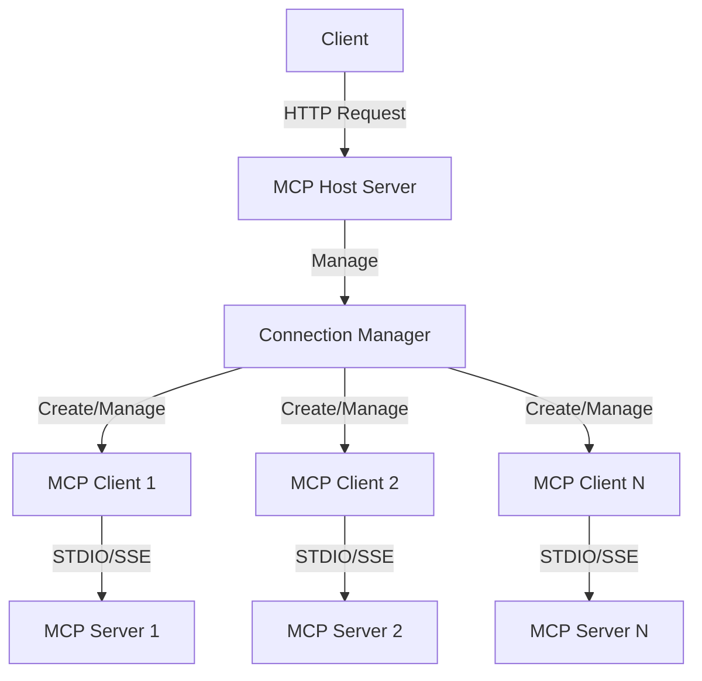

<p align="center">
  <a href="./README.md">中文</a> | EN
</p>

# mcp-host-use

### mcp-host-use is a Node.js-based Model Context Protocol (MCP) host application for connecting and managing multiple MCP servers. The Host provides a unified interface that allows clients to interact with multiple MCP servers through HTTP APIs, accessing and invoking tools (or resources). You can use it to quickly test and run your MCP Servers.

## Architecture Diagram



## Key Features
- Support for connecting multiple MCP servers simultaneously, managed through a `json` file
- Support for both STDIO and SSE transport methods
- Provides unified HTTP API interfaces for:
    - Retrieving tool lists from all servers
    - Invoking tools on specific servers
    - Getting resource lists from all servers
    - Accessing resources from specific servers
    - Triggering Host to actively update Server connections

## Project Structure
```bash
mcp-host-use/
├── src/                      # Source code directory
│   ├── main.ts               # Main entry file
│   ├── host.ts               # MCP connection manager
│   ├── client.ts             # MCP client implementation
│   ├── server.ts             # HTTP server implementation
│   ├── types.ts              # Type definitions
│   └── utils.ts              # Utility functions
```

## Requirements
- **For connecting to STDIO MCP Server, requires `npx` or `uvx` system runtime environment.**
  - `npx` requires Nodejs (>=18)
  - `uvx` requires Python (uv)

## Usage

### 1. Using `npm` package, no local build required (Recommended)

`npx mcp-host-use`

### 2. Local build, clone this repository `git clone https://github.com/liujilongObject/mcp-host-use.git`

#### Install dependencies
- `npm install`

#### Development mode
- `npm run dev`

#### Production mode
- `npm run build`
  - For production use:
    - Using custom Node.js environment: `production_node.exe dist/index.js`
    - Using host machine's Node.js environment: `node dist/index.js`

## Servers Configuration File

`mcp-host-use` reads the `mcp_servers.config.json` file from the **current working directory**, with the following format:

```json
{
    "mcp_servers": [
        {
            "enabled": true, // Whether to enable the server
            "type": "stdio", // 'stdio' | 'sse'
            "server_name": "server-puppeteer", // Custom name
            "command": "npx",
            "args": [
                "-y",
                "@modelcontextprotocol/server-puppeteer"
            ]
        },
        {
            "enabled": true,
            "type": "sse",
            "server_name": "server-everything-sse",
            "sse_url": "http://localhost:3001/sse"
        },
        {
            "enabled": true,
            "type": "stdio",
            "server_name": "github",
            "command": "npx",
            "args": [
                "-y",
                "@modelcontextprotocol/server-github"
            ],
            "env": { // Supports environment variable configuration
                "GITHUB_PERSONAL_ACCESS_TOKEN": "<YOUR_TOKEN>"
            }
        }
    ]
}
```

## Notes
- The server runs on port 17925 by default
- Ensure server information in the configuration file is correct
- For STDIO transport method, ensure the following commands are executable:
    - `npx`
    - `uvx`
- For SSE transport method, ensure the URL is accessible

## API Endpoints

## Tools

### 1. Get All Tools List

```typescript
import { MCPConnectionManager } from '@modelcontextprotocol/mcp-host'

const toolsOfServers = await getTools(manager: MCPConnectionManager)
```

#### Response
```typescript
type ToolsResponse = {
  server_name: string
  tools: {
    name: string
    description: string
    inputSchema: object
  }[]
}[]
```

### 2. Invoke Tool

```typescript
const result = await toolCall(
  manager: MCPConnectionManager,
  {
    serverName: string,
    toolName: string,
    toolArgs: Record<string, unknown>
  }
)
```

## Resources

### 1. Get All Resources List

```typescript
const resourcesOfServers = await getResources(manager: MCPConnectionManager)
```

#### Response
```typescript
type ResourcesResponse = {
  server_name: string
  resources: {
    uri: string
    mimeType: string
    name: string
  }[]
}[]
```

### 2. Read Specific Resource

```typescript
const resource = await readResource(
  manager: MCPConnectionManager,
  {
    serverName: string,
    resourceUri: string
  }
)
```

#### Response
```typescript
type ResourceResponse = {
  mimeType: string
  text?: string
  blob?: Blob
}
```

## Connections

### 1. Update Server Connection

> **After calling this method, the Host will actively read the configuration file and create/restart/delete Server connections based on the updated configuration. No need to restart the Host service, continue using other methods to get the updated Server information.**

```typescript
await manager.refreshConnections()
```
```

## License

MIT
