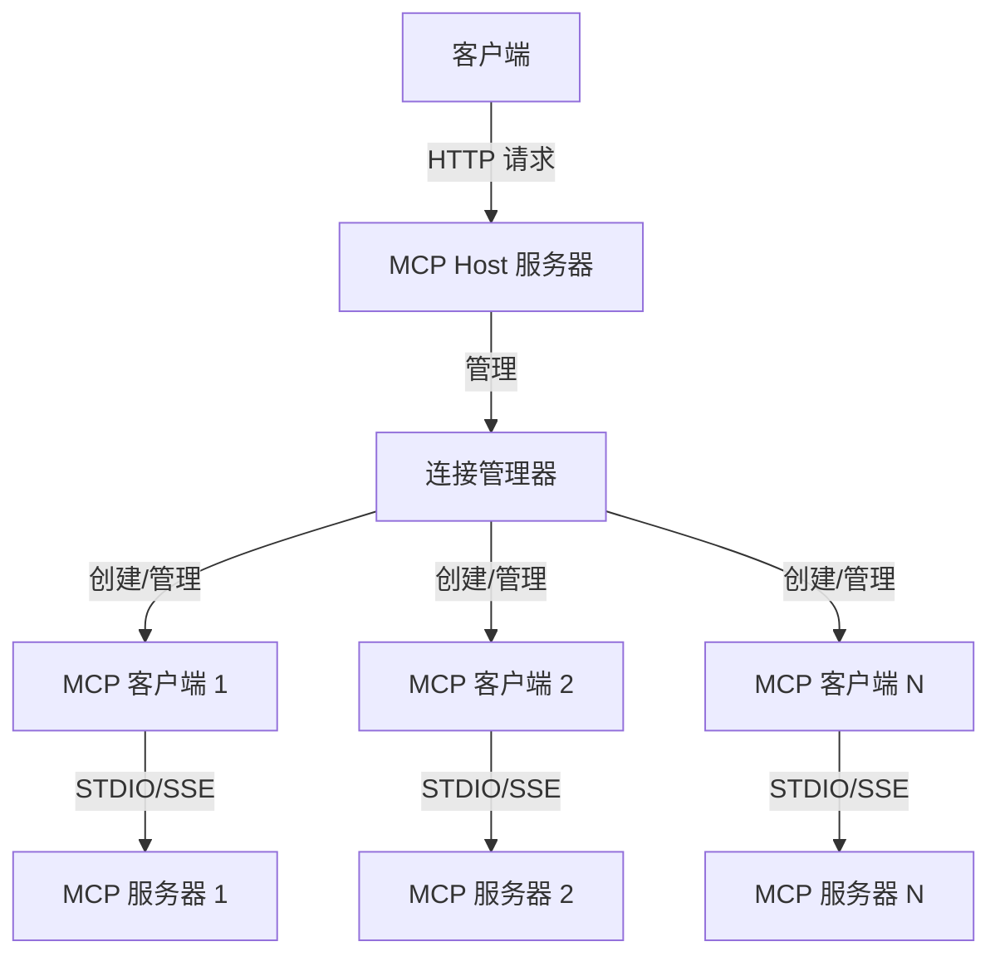

<p align="center">
  中文 | <a href="./README.EN.md">EN</a>
</p>

# mcp-host

`mcp-host` 是一个基于 Node.js 的 Model Context Protocol (MCP) 主机应用程序，用于连接和管理多个 MCP 服务器。它提供了统一的接口，允许客户端通过 HTTP API 与多个 MCP 服务器进行交互，访问及调用工具(或资源)。

## 架构图



## 主要功能

- 多服务器管理：支持同时连接多个 MCP 服务器，通过 `json` 文件统一管理
- 双传输模式：支持 STDIO 和 SSE 两种传输方式
- 统一 API 接口：
  - 获取所有服务器的工具列表
  - 调用特定服务器上的工具
  - 获取所有服务器的资源列表
  - 获取特定服务器上的资源
  - 触发 Host 主动更新 Server 连接
- 开发模式支持：支持配置文件热更新，无需重启服务
- 优雅关闭：支持进程信号处理，确保服务优雅退出


## 项目结构

```bash
mcp-host/
├── src/                      # 源代码目录
│   ├── main.ts               # 主入口文件
│   ├── host.ts               # MCP 连接管理器
│   ├── client.ts             # MCP 客户端实现
│   ├── server.ts             # HTTP 服务器实现
│   ├── types.ts              # 类型定义
│   ├── actions.ts            # API 动作处理
│   ├── colors.ts             # 控制台颜色
│   ├── logger.ts             # 日志工具
│   └── utils.ts              # 工具函数
```

## 环境要求

- Node.js >= 18
- 连接 STDIO MCP Server 需要：
  - `npx` 或 `uvx` 的系统运行环境
  - `uvx` 依赖 Python (uv)


## 安装使用

### 1. 安装

```bash
npm install @mcp-synergy/host
```

### 2. 使用

```typescript
import { MCPHost } from '@mcp-synergy/host';

// 创建MCPHost实例
// 参数1: 配置文件路径
// 参数2: 是否启用配置文件热更新（开发模式推荐开启）
const mcpHost = new MCPHost('./mcp_servers.config.json', true);

// 启动服务
await mcpHost.start();
```

### 3. 本地开发

1. 克隆仓库
```bash
git clone <repository_url>
cd mcp-host
```

2. 安装依赖
```bash
npm install
```

3. 开发模式
```bash
npm run dev
```


## Servers 配置文件

`mcp-host-use` 会读取**当前工作目录**下的 `mcp_servers.config.json` 文件，文件格式如下：

```json
{
    "mcp_servers": [
        {
            "enabled": true, // 是否启用 server
            "type": "stdio", // 'stdio' | 'sse'
            "server_name": "server-puppeteer", // 自定义 name
            "command": "npx",
            "args": [
                "-y",
                "@modelcontextprotocol/server-puppeteer"
            ]
        },
        {
            "enabled": true,
            "type": "sse",
            "server_name": "server-everything-sse",
            "sse_url": "http://localhost:3001/sse"
        },
        {
            "enabled": true,
            "type": "stdio",
            "server_name": "github",
            "command": "npx",
            "args": [
                "-y",
                "@modelcontextprotocol/server-github"
            ],
            "env": { // 支持配置环境变量
                "GITHUB_PERSONAL_ACCESS_TOKEN": "<YOUR_TOKEN>"
            }
        }
    ]
}

```

## 注意事项

- 对于 STDIO 传输方式，需要确保 `npx` 或 `uvx` 命令可执行
- 对于 SSE 传输方式，需要确保 URL 可访问
- 开发模式下支持配置文件热更新
- 生产环境建议关闭配置文件监听


## API Endpoints

## Tools

### 1. 获取所有工具列表

```typescript
// 获取所有可用工具列表
const toolsList = await mcp.getTools()
// 返回结果示例：
[
  {
    server_name: "服务器1",
    tools: [
      {
        name: "工具名称",
        description: "工具描述",
        inputSchema: { ... }
      }
    ]
  }
]
```

### 2. 调用工具

```typescript
// 调用指定服务器上的工具
const result = await mcp.toolCall({
  serverName: "服务器名称",
  toolName: "工具名称",
  toolArgs: { ... }
})
// 返回工具执行结果
```

## Resources

### 1. 获取所有资源列表

```typescript
// 获取所有可用资源列表
const resourcesList = await mcp.getResources()
// 返回结果示例：
[
  {
    server_name: "服务器1",
    resources: [
      {
        uri: "资源URI",
        mimeType: "资源类型",
        name: "资源名称"
      }
    ]
  }
]
```

### 2. 读取特定资源

```typescript
// 读取指定服务器上的资源
const resource = await mcp.readResource({
  serverName: "服务器名称",
  resourceUri: "资源URI"
})
// 返回结果示例：
[
  {
    mimeType: "资源类型",
    text: "text 类型资源",
    blob: "blob 类型资源"
  }
]
```

## Connections

### 1. 更新 Server 连接

> **调用该方法后，Host 会主动读取配置文件，并根据更新的配置来 新建/重启/删除 Server 连接。无需重启 Host 服务，继续调用其他方法可以获取更新后的 Server 信息。**

```typescript
// 更新服务器连接
await mcp.updateConnections()
// 成功更新服务器连接
```
```

## License

MIT
